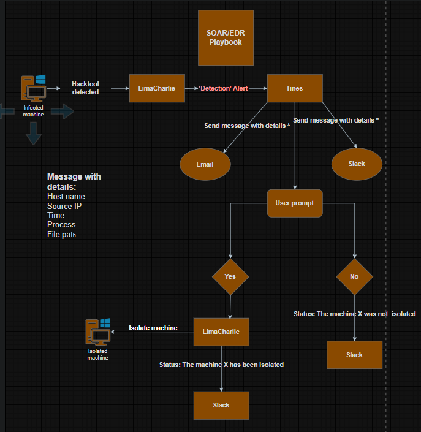
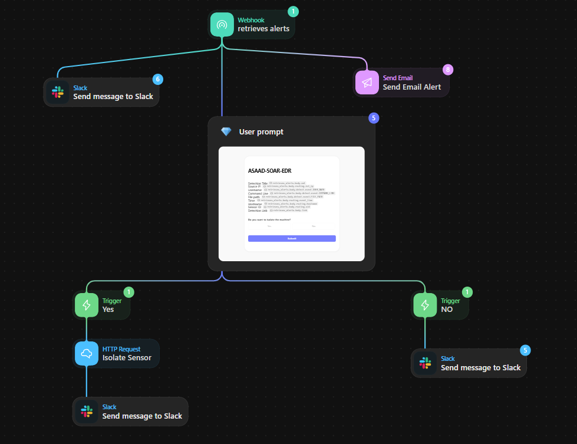

# 🛡️ SOAR & EDR Automation: Automated Incident Response Project

## 📌 Introduction
Ce projet illustre la mise en place d'une chaîne de réponse aux incidents entièrement automatisée (**SOAR**) intégrant la détection **EDR** et une validation humaine (**Human-in-the-loop**).

L'objectif est de détecter l'exécution d'outils de vol d'identifiants (*LaZagne*) et d'automatiser l'isolation de la machine compromise via **ChatOps** (Slack), réduisant drastiquement le temps de réponse (MTTR).

### 🛠️ Tech Stack
* **EDR:** LimaCharlie (Detection & Response)
* **SOAR:** Tines (Orchestration & Automation)
* **Communication:** Slack (Alerting & Decision Making)
* **Adversary Simulation:** LaZagne (Credential Dumping Tool)

---

## 🏗️ Architecture & Workflow

Le flux de travail suit le cycle de vie suivant : **Détection -> Enrichissement -> Décision -> Remédiation**.



**Workflow Logique :**
* **1. **Détection :** L'agent LimaCharlie détecte l'exécution du processus `LaZagne.exe` sur le endpoint.
* **2. **Orchestration :** L'alerte est transmise à Tines via Webhook. Tines extrait les IoCs (IP, Hostname, Process Path).
* **3. **Décision (ChatOps) :** Tines envoie une carte interactive sur Slack demandant à l'analyste : *"Voulez-vous isoler la machine ?"*.
* **4. **Action :** Si l'analyste clique sur **YES**, Tines utilise l'API de LimaCharlie pour isoler la machine du réseau instantanément.

---
## ⚙️ LimaCharlie Configuration (Detection & Response)

Au lieu d'images statiques, voici le code YAML réel utilisé pour la détection et la réponse, basé sur les configurations du projet.

### 1. Règle de Détection (Detection Rule)
Cette règle cible spécifiquement l'outil LaZagne via le nom de fichier, la ligne de commande ou le hash malveillant.

```yaml
# Detection Rule
events:
  - NEW_PROCESS
  - EXISTING_PROCESS
op: and
rules:
  - op: is windows
  - op: or
    rules:
      - case sensitive: false
        op: ends with
        path: event/FILE_PATH
        value: LaZagne.exe
      - case sensitive: false
        op: ends with
        path: event/FILE_PATH
        value: all
      - case sensitive: false
        op: contains
        path: event/COMMAND_LINE
        value: LaZagne
      - case sensitive: false
        op: is
        path: event/HASH
        value: 'dc06d62ee95062e714f2566c95b8edaabfd387023b1bf98a09078b84007d5268'
# Response Rule
- action: report
  metadata:
    author: ASAAD
    description: TEST - Detects Lazagne Usage
    falsepositives:
      - ToTheMoon
    level: high
    tags:
      - attack.credential_access
  name: ASAAD-HackTool(Lazagne)
```

## 🧠 Tines Playbook (Automation Logic)

L'intelligence du projet réside dans le storyboard Tines qui gère la logique conditionnelle.



**Étapes clés du Playbook :**
* **Webhook :** Réception de l'alerte JSON brute depuis l'EDR.
* **User Prompt :** Génération d'un formulaire interactif envoyé aux analystes avec les détails critiques de l'attaque.
* **Triggers (Yes/No) :** Branchement conditionnel basé sur la réponse de l'analyste.
* **HTTP Request (Isolate Sensor) :** En cas de réponse positive, envoi d'une requête API POST pour isoler le capteur concerné.

---


